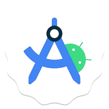

## Hi there   I'm Fatiha LAAOUAFI 👋 a data scientist.

 
 
 
</img>

### who am i ?  
- backend developer using Flutter and Python  
- student in the Higher School of Technologies in Essaouira studying <strong> data science </strong>
- certificated by oracle AI foundation 
### 🌐 Find Me Around the Web
- **Fiverr:** <a href="https://fr.fiverr.com/fatiha_laa?up_rollout=true"> Fiverr</a>
- **Email1:** <a href="laaouafifatiha@gmail.com"> laaouafifatiha@gmail.com </a>
- **Email2:** <a href="f.laaouafi5125@uca.ac.ma"> f.laaouafi5125@uca.ac.ma </a>
- **LinkedIn:** [![LinkedIn][linkedin-shield]][linkedin-url]
- **phone:** 0679807906

###  What I'm Learning    
- data maining 
- Machine Learning

###  Technologies & Tools

<table>
	<tr>
		<td><code></code></td>
		<td><code></code></td>
			<td><code></code></td>
			<td><code></code></td>
			<td><code></code></td>
			<td><code></code></td>
		</tr>
		<tr>
			<td><code></code></td>
			<td><code></code></td>
			<td><code></code></td>
			<td><code></code></td>
			<td><code></code></td>
			<td><code></code></td>
		</tr>
		<tr>
		</tr>
		<tr>
			<td><code></code></td>
			<td><code></code></td>
			<td><code></code></td>
			<td><code></code></td>
			<td><code></code></td>
			<td><code></code></td>
	</tr>
	<tr> 

<td><code></code></td>
			<td><code></code></td>
			<td><code></code></td>
			<td><code></code></td>
			<td><code></code></td>
			<td><code></code></td>
	

  
</tr>
</table>

 

### 🚀 My Projects
-  <a href="https://github.com/LAAOUAFIFATIHA/PHP_Caisse">Caisse</a>
-  <a href="https://github.com/LAAOUAFIFATIHA/weatherForcast">weatherForcast</a>
-  <a href="https://github.com/LAAOUAFIFATIHA/first_flutter_app">first_flutter_app</a>
-  <a href="https://github.com/LAAOUAFIFATIHA/flutter_PickSchool_app">flutter_PickSchool_app</a>

## 📈 GitHub Stats

<!-- MARKDOWN LINKS & IMAGES -->
[linkedin-shield]: https://img.shields.io/badge/-LinkedIn-black.svg?style=for-the-badge&logo=linkedin&colorB=555
[linkedin-url]:https://www.linkedin.com/in/fatiha-laaouafi-4227252ba/
